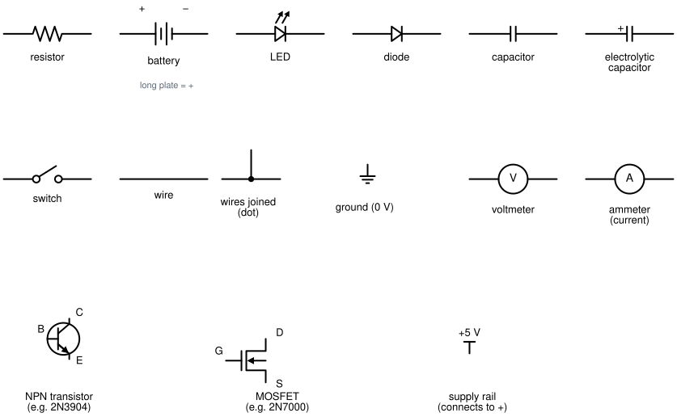

# Stage 0 — Foundations and craft

> **Where this stage starts:** no components, no soldering iron, no electronics theory.
> **Where it ends:** a working **logic probe**, a handheld tool that tells you whether a wire is
> HIGH, LOW, or **floating** (connected to nothing). You'll use it to debug the whole CPU in Stage 1.

---

## How to read these guides
Each session has its own file (S0.1 to S0.11). They're written like textbook chapters, and every
one follows the same pattern:

1. **In one line**: what the session is about.
2. **Where this fits**: why it matters and how it connects to the rest.
3. **Words you'll need**: every new term, explained before it's used. Each session builds on the
   words from the ones before it, so read them in order.
4. **The idea**: the main concept, explained plainly.
5. **Before you start**: safety, what you need, and some questions to answer *before* building.
6. **Steps**: what to actually do.
7. **How you know you're done**: the only way out of a session.

**Answers are hidden in folded "Hint" boxes.** Try first; open a hint only if you're stuck, and
write in the log that you did. Doing the thinking is the point.

### What the codes mean
The guides follow a **syllabus** (the full course plan, kept as a separate page:
https://claude.ai/artifact/FHaGsWE8ByLJts76SCWkuU). Its codes appear in small print at the bottom of
each guide, so you can trace things back to it:

| Code | Means | Example |
|---|---|---|
| **S0.3** | **Session** 3 of Stage 0: one of these guide files | S0.3 = the first circuit |
| **M0.2** | **Module** 2 of Stage 0: a group of sessions that ends with something built | M0.2 = DC circuits, ending with the dimmer |
| **0.2.6** | **Objective** 6 of module M0.2: one specific thing you must be able to *do* | 0.2.6 = measure voltage, current and resistance correctly |
| **C0** | **Capstone** of Stage 0: the stage's final project | the logic probe |

You don't need the codes to follow the guides. They're there so a mistake in the log can be traced
to the exact thing that hadn't been learned yet.

### The session types
- 🛠️ **Bench session:** 2–3 hours at the bench, usually at the weekend.
- 🌙 **Evening session:** about an hour of reading or design at a desk, no tools.

A realistic pace is two bench sessions a weekend plus one or two evenings, which is about **5 weeks**
for the whole stage.

---

## Reading circuit diagrams
Most figures in these guides are **schematics** (circuit diagrams). A schematic is a map of the
connections, not a picture of what the circuit looks like. A long line on paper might be two
centimetres of wire on the breadboard, and the parts are drawn as standard symbols rather than as
they look.

Three rules cover almost everything:
1. **A line is a wire.** Everything joined by a line is at the same voltage.
2. **A dot means wires are joined.** Two lines that cross *without* a dot are not connected; they
   just pass over each other on paper.
3. **Ground** (the symbol with three shrinking lines) is the 0 V point everything is measured from.
   Every ground symbol in one diagram is connected to every other one, even if no line is drawn
   between them.

*The symbols you'll meet in Stage 0. Keep this page open while you read the session guides.*

The **battery** symbol is a stack of long and short plates. The **long plate is +**. On the LED and
diode symbols, the triangle points the way current is allowed to flow, and the bar is the − end.

---

## Where to learn more
Each guide ends with **Further reading**: free sources, picked for that session. The main ones:
- **[Lessons in Electric Circuits](https://www.ibiblio.org/kuphaldt/electricCircuits/)** by Tony R.
  Kuphaldt: a complete electronics textbook, free online. Volume I covers DC circuits (S0.1–S0.5),
  Volume III covers transistors (S0.8) and Volume IV covers logic gates (S0.9).
- **[SparkFun Learn](https://learn.sparkfun.com/tutorials)**: short illustrated tutorials, one topic
  each. Good when a single idea isn't clicking.
- **[Adafruit Guide to Excellent Soldering](https://learn.adafruit.com/adafruit-guide-excellent-soldering)**:
  for S0.6 and S0.7.
- **Simulators**, to try a circuit before the parts arrive:
  [PhET Circuit Construction Kit](https://phet.colorado.edu/en/simulations/circuit-construction-kit-dc)
  (simplest), [Falstad](https://www.falstad.com/circuit/) (more powerful), and
  [logic.ly](https://logic.ly/demo) for gates.

The figures in these guides were drawn by Claude (Anthropic) with a script, `img/make_figures.py`.
To change one, edit the script and run it again.

---

## How every session runs
1. Open the session's file. Read **Before you start**. If the safety section needs something you
   don't have, **stop**. That's a blocker to sort out, not a risk to take.
2. Answer the questions **in writing, before building**.
3. Do the steps in order. Every number gets **predicted first**, written in the notebook
   (`notebook/stage-0.md`), and only then measured.
4. **"How you know you're done"** is the only way out. "I watched the video" or "it lit up" doesn't
   count.
5. Answer the same questions again. Any you still get wrong go on camera.
6. Write the build-log entry: a new file in `projects/bench-to-flight/log/`, listed in
   `BUILD-LOG.md`. Real time spent (rounded down), who did what, and **what failed, in more detail
   than what worked**.
7. Photograph the bench before you tidy up.

---

## The sessions

| # | Session | Module | Type | New things you need for it |
|---|---|---|---|---|
| [S0.1](S0-01-logbook-parts-safety.md) | Logbook, parts store, and the three hazards | M0.1 | 🛠️ | component assortment, multimeter, labelled box or drawers |
| [S0.2](S0-02-datasheets.md) | Reading a datasheet | M0.1 | 🌙 | nothing (PDFs) |
| [S0.3](S0-03-first-circuit.md) | First circuit: LED, resistor, measured current | M0.2 | 🛠️ | breadboard and jumper wire, 9 V battery and clip, red LEDs |
| [S0.4](S0-04-dividers-loading.md) | Voltage dividers, loading, and the meter as part of the circuit | M0.2 | 🛠️ | 10 kΩ and 10 MΩ resistors |
| [S0.5](S0-05-thevenin-dimmer.md) | Thévenin's theorem, and the dimmer | M0.2 | 🛠️ | slide switch or jumpers |
| [S0.6](S0-06-soldering-joints.md) | Soldering I: fifty joints | M0.3 | 🛠️ | **soldering station**, solder, flux, practice perfboard, **eye protection** |
| [S0.7](S0-07-desolder-perfboard.md) | Soldering II: desoldering, and the permanent dimmer | M0.3 | 🛠️ | desoldering braid, solder pump, perfboard, hookup wire |
| [S0.8](S0-08-transistor-switch.md) | The transistor as a switch | M0.4 | 🛠️ | **5 V power source**, 2N3904 and 2N7000 transistors |
| [S0.9](S0-09-discrete-nand.md) | A NAND gate from transistors, then NOT, AND and OR | M0.4 | 🛠️ | more 2N3904s |
| [S0.10](S0-10-probe-design.md) | Final project, part 1: designing the logic probe | C0 | 🌙🌙 | KiCad (free software), a 74HC chip's datasheet |
| [S0.11](S0-11-probe-build.md) | Final project, part 2: building and testing the probe | C0 | 🛠️🛠️ | the parts from S0.10's shopping list, a small case |

---

## Buy in stages, not all at once
The syllabus prices the full bench at about S$400. You don't need all of it on day one. Here's what
each purchase actually unlocks:

| Needed by | What | Second-hand OK? |
|---|---|---|
| **S0.1** | A multimeter (with a fuse on its current input, and a continuity beep that's instant); a component assortment (standard resistor values, ceramic and electrolytic capacitors, LEDs, 2N3904 and 2N7000 transistors, pin headers); storage | Multimeter ✅: check the fuse is intact and the beep is instant. Assortment ⛔: buy new |
| **S0.3** | A breadboard (1–2 now, 4–6 by Stage 1); solid-core jumper wire; 9 V battery and snap clip | ⛔ **New only.** A worn breadboard has loose, unreliable contacts, and its faults look like *your* mistakes |
| **S0.6** | A temperature-controlled soldering station; 0.6–0.8 mm rosin-core solder; flux; tip cleaner; **eye protection**; ventilation (fan and an open window) | Station ✅, as long as it's temperature-controlled and you can still buy tips for it. Consumables ⛔: new |
| **S0.7** | Desoldering braid and pump; perfboard; hand tools (flush cutters, wire strippers, tweezers, a "helping hands" clamp) | Hand tools ✅ |
| **S0.8** | A steady **5 V** power source: a USB breadboard power module works; an adjustable bench power supply is better | Bench supply ✅, but it **must** have an adjustable current limit. Ask the seller to short the output and show you the current-limit light coming on |
| **Stage 1** | An 8-channel USB logic analyser; more breadboards; 74HC chips | Analyser ✅ |

---

## What to film (no editing needed)
The syllabus rule: **no finished object, no closed module, no episode.** Episodes come out of the
things you build:
- **Episode 0:** the bench. What you bought, any second-hand finds, what each instrument is for.
- **Episode 1** (S0.3–S0.5): "Predicted vs measured". The LED, the divider surprise, the dimmer.
- **Episode 2** (S0.6–S0.7): fifty joints, the five worst diagnosed, and the drop test.
- **Episode 3** (S0.8–S0.9): a logic gate from four transistors, and the floating gate that reacts
  to your finger.
- **Episode 4** (S0.10–S0.11): the logic probe, catching a floating input.

⚠️ Raw footage and a voiceover only. Time spent editing isn't time spent learning.
