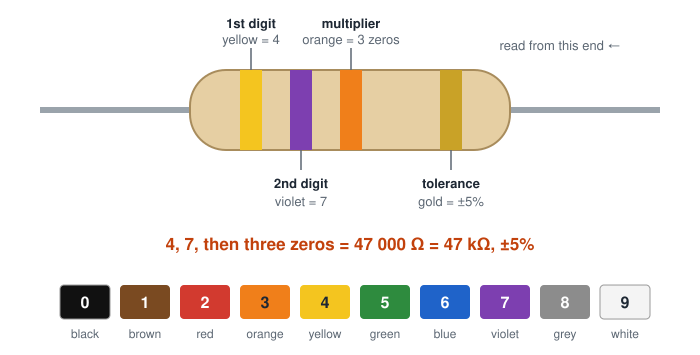
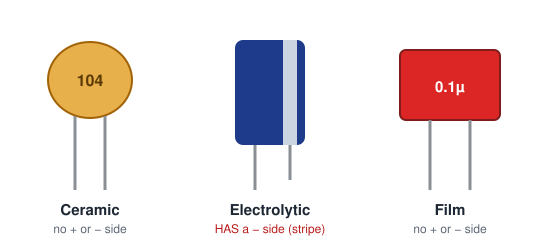
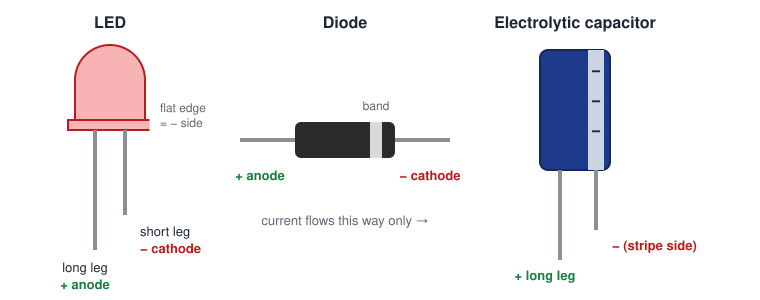

# S0.1 — Logbook, parts store, and the three hazards

> **In one line:** set up a notebook, learn to read the values printed (or painted) on small
> components, sort them into a labelled store, and write down what on this bench can hurt you.

**A bench session, about 2½ hours.** Nothing gets plugged in or powered today.

---

## Where this fits
Before you can build a circuit you need to be able to pick up a part and know what it is. A
resistor doesn't have "1 kΩ" written on it; it has coloured stripes. A capacitor might just say
`104`. This session teaches you to read those markings without looking them up, and it starts the
habit the whole course runs on: **write down what you expect, then measure, then compare.**

---

## Words you'll need
Read this section once before the steps. Each word builds on the one before it.

- **Current** is the flow of electric charge through a wire. It's measured in **amps (A)**. Small
  circuits use thousandths of an amp: **milliamps (mA)**. 1 A = 1000 mA.
- **Voltage** is the "push" that makes current flow, measured in **volts (V)**. A 9 V battery
  pushes harder than a 1.5 V AA cell. Voltage is always measured *between two points*, like
  height is measured between the floor and the top of a table.
- **Resistance** is how hard it is for current to get through something, measured in **ohms (Ω)**.
  A big resistance lets only a little current through. 1 kΩ (kilo-ohm) = 1000 Ω, and
  1 MΩ (mega-ohm) = 1,000,000 Ω.
  > A common way to picture it: voltage is water pressure, current is how much water flows, and
  > resistance is how narrow the pipe is. The picture breaks down eventually, but it's good for now.
- A **resistor** is a part whose only job is to have a known resistance. You use one to limit how
  much current flows somewhere, for example through an LED so it doesn't burn out.
- **Tolerance** is how close to its label a part is promised to be. A 1000 Ω resistor with ±5%
  tolerance can really be anywhere from 950 Ω to 1050 Ω, and still count as correct.
- A **capacitor** stores a small amount of charge, a bit like a tiny, very fast rechargeable
  battery. Its size is measured in **farads (F)**, but real capacitors are tiny fractions of a
  farad: **microfarads (µF)** = millionths, **nanofarads (nF)** = billionths, **picofarads (pF)** =
  trillionths. 1 µF = 1000 nF = 1,000,000 pF.
- **Polarity** means a part has a + side and a − side and only works one way round.
- An **LED** (light-emitting diode) is a part that lights up when current flows through it in the
  right direction. A plain **diode** is the same idea without the light: it lets current through
  one way and blocks it the other way.
- A **multimeter** (or just "meter") is the instrument that measures voltage, current and
  resistance. The dial chooses which. The symbol **Ω** on the dial means it's measuring resistance.

---

## The idea: why predict before you measure?
If you just measure things, every number looks fine because you have nothing to compare it with.
If you write down what you *expect* first, a wrong measurement jumps out at you, and working out
*why* it was wrong is where most of the learning happens. So in every session from now on:
**the prediction goes in the notebook, with the date, before the meter touches anything.**

Today's predictions are easy (reading a resistor's stripes and guessing its value), which makes
it a good place to start the habit.

---

## Before you start
- **Hazards today:** nothing electrical, because nothing is powered. One small thing: when you cut
  the wire legs ("leads") off components, the cut piece can fly off fast. Point it down at the desk.
- **You need:** the component assortment, the multimeter, a box or set of drawers you can label, a
  notebook.
- **Answer these in writing first**, before reading the steps (they come from the syllabus; it's
  fine to get them wrong, that's what the session is for):
  1. A resistor's stripes read **brown, black, red, gold**. What is its value, what is its
     tolerance, and what is the lowest and highest it could measure and still be within tolerance?
  2. A red LED needs about **2.1 V** across it and should carry **20 mA**. You're running it from
     a **9 V** battery. What resistor do you put in series with it, and how many watts does that
     resistor need to be able to handle?
     (You'll meet the tools for this properly in S0.2 and S0.3. Have a go anyway.)

---

## Steps

### 1. Set up the logbook
On the first page write your name, today's date, and this sentence: *"Predictions are written
before measurements. Dated."* Then copy the table from `logs/NOTEBOOK-TEMPLATE.md` into
`notebook/stage-0.md`. That table has a column for what you predicted and a column for what you
measured, side by side.

### 2. Learn the resistor colour code
Each colour stands for a digit:

| Black | Brown | Red | Orange | Yellow | Green | Blue | Violet | Grey | White |
|---|---|---|---|---|---|---|---|---|---|
| 0 | 1 | 2 | 3 | 4 | 5 | 6 | 7 | 8 | 9 |

*Figure 1.1: reading a 4-band resistor. The colour key along the bottom is the one to memorise.*

On a **4-band** resistor:
- **Band 1** and **band 2** are the first two digits of the value.
- **Band 3** is the **multiplier**: how many zeros to add on the end.
- **Band 4** is the tolerance: **gold = ±5%**, **brown = ±1%**.

To know which end to start from: the tolerance band (often gold or silver) goes on the **right**.
Read from the other end.

*Worked example (not one of the questions above):* yellow, violet, orange, gold → 4, 7, then
add 3 zeros → 47,000 Ω = **47 kΩ**, ±5%.

Some resistors have **5 bands**. Then the first *three* bands are digits, the fourth is the
multiplier and the fifth is the tolerance.

Spend 15 minutes with a printed chart. Then put the chart away and don't look at it again today.
*(Syllabus objective 0.1.1.)*

### 3. The ten-resistor drill: your first predict-then-measure
Pick ten resistors at random. For each one, write three things **before** you measure:
1. The value you read from the stripes.
2. Its tolerance range. For example, 1 kΩ ±5% means anything from 950 Ω to 1050 Ω is fine.
3. *Then* measure it: meter dial on **Ω**, the resistor lying loose on the desk (not plugged into
   anything), and your fingers **not** touching the metal legs.

Write down whether each one is in or out of tolerance.

🔍 **Try this:** take a big resistor (1 MΩ), hold one metal leg in each hand, and measure it again.
The reading changes. Why? Write your guess. *(Your body also conducts a little, so the meter is
now measuring the resistor and you at the same time. You'll come back to this idea in S0.4.)*

### 4. Sort the store
Sort the resistors by size into groups that each cover ten times the last: 1–9.1 Ω, 10–91 Ω,
100–910 Ω, 1–9.1 kΩ, and so on up to 1 MΩ and above. Then put capacitors, LEDs, transistors and
chips in their own compartments. **Label every compartment.** A store you can't find things in
gets ignored.

### 5. Capacitors by sight
You'll see three kinds *(syllabus 0.1.3)*:

| Kind | What it looks like | Typical sizes | Polarity? | What it's used for |
|---|---|---|---|---|
| **Ceramic** | small, flat blob, often yellow or brown | pF to a few µF | no | "decoupling": a small reserve of charge right next to a chip |
| **Electrolytic** | little can (cylinder) with a stripe down one side | µF to thousands of µF | **yes** | storing a larger amount of charge |
| **Film** | small rectangular box | nF to µF | no | timing circuits and audio, where the value must stay steady |

*Figure 1.2: the three kinds of capacitor. Only the electrolytic has a + and − side.*

Small capacitors print a three-digit code instead of a value. The first two digits are a number,
the third is how many zeros to add, and the answer is in **picofarads**. So `104` means 10 followed
by 4 zeros = 100,000 pF = 100 nF = 0.1 µF.

### 6. Polarity: which way round
*(Syllabus 0.1.4.)*

*Figure 1.3: how to tell + from − on the three parts that care.*

- **Electrolytic capacitor:** the stripe marks the **negative (−)** leg.
- **LED:** the **longer leg is positive (+)**, called the **anode**. The rim of the LED also has a
  flat edge on one side: that side is negative, called the **cathode**.
- **Diode:** the painted **band marks the cathode** (the − end).

For each of the three, write down what happens if you put it in backwards. Look it up, then check
against this:

Check your answers

Electrolytic: it heats up and swells, and can burst open ("vent"). · LED: it doesn't light; if
the reverse voltage is high enough (around 5 V or more) it's destroyed. · Diode: it conducts when
it should block, or blocks when it should conduct, so the circuit doesn't do what you designed.

### 7. The three hazards on this bench
*(Syllabus 0.1.8.)* On a page headed **Safety**, write the three things on this bench that can
actually injure someone, and for each one, the rule that prevents it. Start with these three:
- **The soldering iron:** burns, and fire. *Rule:* the iron always goes back in its stand, and it
  is never left on in an empty room.
- **Solder smoke and lead:** the smoke irritates your lungs and eyes, and some solder contains
  lead. *Rule:* fresh air at the bench, wash your hands afterwards, no food at the bench.
- **Stored energy:** LiPo batteries (the flat batteries used in drones and RC cars) can catch fire
  if damaged or charged wrongly, and large capacitors can hold a charge after the power is off.
  *Rule:* written properly in S0.2.

Then add anything specific to *this room*: the window, the extension lead, where the fire
extinguisher is.

---

## How you know you're done
- Ten resistors are in the notebook, each with a prediction written above its measurement.
- **Someone hands you any part from the store and you name its value and rating without looking at
  the label.** This is how the syllabus decides the module is passed. Have your brother test you
  on ten random parts.
- The safety page exists, signed by you, and by your brother, since he'll be at the bench too.

## Log and film
- Build-log entry: the first one. How long it took, who did what, and what you got wrong in the
  drill.
- Film: Episode 0. The bench, the store, and the drill.

## Further reading (free)
- [SparkFun: Voltage, Current, Resistance, and Ohm's Law](https://learn.sparkfun.com/tutorials/voltage-current-resistance-and-ohms-law): the words at the top of this session, with pictures
- [SparkFun: Resistors](https://learn.sparkfun.com/tutorials/resistors): colour codes, tolerance and power ratings
- [SparkFun: Capacitors](https://learn.sparkfun.com/tutorials/capacitors): what they do, the types, and their markings
- [SparkFun: Light-Emitting Diodes (LEDs)](https://learn.sparkfun.com/tutorials/light-emitting-diodes-leds): how LEDs work and which leg is which
- [SparkFun: Diodes](https://learn.sparkfun.com/tutorials/diodes): the one-way valve for current

Syllabus: module M0.1, objectives 0.1.1, 0.1.3, 0.1.4, 0.1.8. What these codes mean:
`curriculum/stage-0/README.md`.
