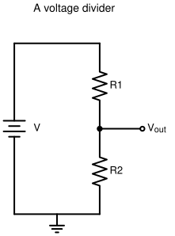
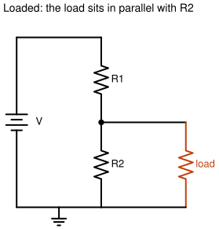
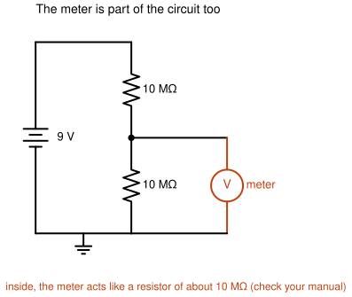

# S0.4 — Voltage dividers, loading, and the meter as part of the circuit

> **In one line:** build the most-used circuit in electronics, then watch it give a different
> answer the moment you connect something to it, including your own meter.

**A bench session, about 2 hours.**

---

## Where this fits
A **voltage divider** turns one voltage into a smaller one using just two resistors. You'll use it
constantly: the logic probe at the end of this stage is built around one. But a divider has a
catch: it only gives the voltage you calculated when **nothing else is connected to it**. Connect
anything, even the meter you're using to check it, and the voltage moves. Almost every "my reading
is wrong" problem later in the course starts with this idea.

---

## Words you'll need
(Builds on S0.3: series, parallel, node, Ohm's law, voltages adding up around a loop.)

- **Kirchhoff's two laws** are the rules every circuit obeys:
  - **Current law:** the current flowing into a node equals the current flowing out. Charge doesn't
    pile up or vanish. So in a single series loop, the current is the same everywhere.
  - **Voltage law:** go around any closed loop and the voltages add up to zero. In practice: the
    battery's voltage is shared out between the parts in series with it.
- **Resistors in series add:** two 10 kΩ in series behave like one 20 kΩ.
- **Resistors in parallel combine to something smaller than either one**, because current now has
  two routes instead of one. For two resistors:

  &nbsp;&nbsp;&nbsp;&nbsp;Rparallel = (R1 × R2) ÷ (R1 + R2)

  The symbol **∥** is shorthand for "in parallel with": R1 ∥ R2.
- **Ground** is the point in a circuit you call 0 V and measure everything else from. Here, it's
  the battery's − terminal.
- **Vout** is the voltage you take out of a circuit, here the voltage at the divider's
  midpoint, measured from ground.
- **Loading** is what happens when you connect something (a **load**) to a circuit's output and it
  draws current, changing the voltage you were measuring.
- **Input impedance** is, for our purposes, the resistance a meter has *between its probes when it's
  measuring voltage*. It's large, but it isn't infinite, so the meter itself is a (very weak) load.

---

## The idea: a divider, and why it "lies"

*Figure 4.1: a voltage divider. Vout is measured from the midpoint to ground.*

Put two resistors, R1 on top and R2 below, in series across a battery. The same current flows
through both (current law). The battery's voltage is shared between them in proportion to their
resistances (voltage law plus Ohm's law). Take the voltage from the point between them and you get
a fraction of the battery voltage.

Now connect a third resistor from that midpoint to ground. It sits **in parallel with R2**. Two
resistors in parallel are smaller than one, so the bottom half of the divider now has less
resistance, gets a smaller share of the voltage, and the midpoint voltage **drops**. That's
loading.

*Figure 4.2: a loaded divider. The load and R2 are now in parallel.*

And here's the twist you'll find today: your **meter** is also a resistor, connected from the
midpoint to ground every time you measure. Usually it's so large compared with the divider that you
can't tell. Build a divider from very large resistors, and suddenly you can.

---

## Before you start
- **Hazards:** none.
- **You need:** 9 V battery, three 10 kΩ resistors, two 10 MΩ resistors, and your meter's manual
  (or its specification sheet online).
- **Answer these in writing first:**
  1. Two 10 kΩ resistors in series across 9 V. What's the voltage at the midpoint? Now connect a
     third 10 kΩ from the midpoint to ground. What's the midpoint voltage now, and why did it move?
  2. You build a divider from two **10 MΩ** resistors and measure the midpoint with your meter.
     What do you expect to read? (Guess now, and explain the real reading at the end.)

---

## Steps

### 1. Derive the divider formula yourself
*(Syllabus 0.2.2.)* On paper, starting from Kirchhoff's laws and Ohm's law, work out the formula
for the midpoint voltage. The chain of reasoning: the same current flows through both resistors →
that current is the battery voltage divided by the *total* resistance → the voltage across R2 is
that current times R2. You should end up with:

&nbsp;&nbsp;&nbsp;&nbsp;Vout = V × R2 ÷ (R1 + R2)

Do the working yourself rather than just copying the answer. You'll need to rebuild this from
scratch many times.

### 2. The unloaded divider
Two 10 kΩ resistors in series across the battery. Predict the midpoint voltage, using half of your
**measured** battery voltage (not "4.5 V"). Measure it.

### 3. The loaded divider
*(Syllabus 0.2.4.)* Add a third 10 kΩ from the midpoint to ground. **Predict** the new midpoint
voltage before measuring. Measure. Write down why it moved.

Hint
The load is in parallel with the bottom resistor. What is
10 kΩ ∥ 10 kΩ? Put that back into your divider formula as the new R2.

### 4. Find your meter's input impedance
*(Syllabus 0.2.8.)* Look in the manual's DC voltage specification. It's usually about 10 MΩ, but
find the real number for *your* meter and write it down.

### 5. The surprise
*(The second question you answered at the start.)* Rebuild the divider with two **10 MΩ**
resistors.

*Figure 4.3: what's really connected when you measure a 10 MΩ divider.*

1. Predict the midpoint voltage as if the meter weren't there.
2. Measure it.
3. Now predict again, this time treating the meter as **one more resistor**, of its input impedance,
   in parallel with the bottom 10 MΩ. Compare all three numbers.

🔍 Film this one. Your measuring instrument changed the thing it was measuring.

### 6. Power check
*(Syllabus 0.2.3.)* For the 10 kΩ divider, calculate the current, and the power turned into heat
in each resistor (S0.2's formula). Which one gets warm? (Neither does. Say why.)

---

## How you know you're done
- Your loaded and unloaded readings match your predictions within the resistors' tolerance, or the
  difference is explained.
- You can explain the 10 MΩ result to your brother in two sentences, using the word "parallel".

## Further reading (free)
- [SparkFun: Voltage Dividers](https://learn.sparkfun.com/tutorials/voltage-dividers): the formula, worked examples, and where dividers turn up
- [Lessons in Electric Circuits, Vol. I, ch. 6: Divider Circuits and Kirchhoff's Laws](https://www.ibiblio.org/kuphaldt/electricCircuits/DC/DC_6.html): the textbook version of steps 1–3
- [Lessons in Electric Circuits, Vol. I, ch. 8: DC Metering Circuits](https://www.ibiblio.org/kuphaldt/electricCircuits/DC/DC_8.html): how meters work inside, and how they disturb what they measure

Syllabus: module M0.2, objectives 0.2.1, 0.2.2, 0.2.3, 0.2.4, 0.2.8. What these codes mean:
`curriculum/stage-0/README.md`.
