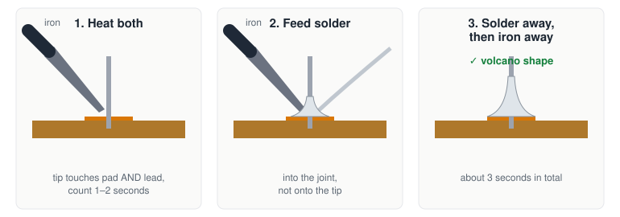
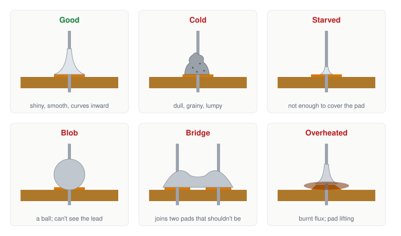

# S0.6 — Soldering I: fifty joints

> **In one line:** learn to join metal parts with melted solder by doing it fifty times, including
> making the common mistakes on purpose so you can recognise them.

**A bench session, about 3 hours.** ⚠️ This is the first session with a real hazard. Read the
safety section in full before you switch anything on.

---

## Where this fits
Breadboards are for trying things out. Anything permanent (the dimmer in S0.7, the logic probe at
the end of the stage) gets **soldered**. Soldering is a craft: you get good at it through hours of
practice rather than through understanding. The syllabus expects your brother may get better at it
faster than you. If he does, let him, and film it.

---

## Words you'll need
- **Solder** is a soft metal wire that melts at a few hundred °C. Melted between two pieces of
  metal, it sets solid and joins them, both holding them together and conducting electricity.
- A **soldering iron** heats a metal **tip** to melt the solder. A **temperature-controlled
  station** lets you set the tip temperature exactly.
- **Flux** is a chemical that cleans the metal surfaces as they heat up, so the solder can flow and
  stick. Most solder wire already has flux inside it (**rosin-core** solder). You can also add
  extra flux from a pen or a pot.
- **Tinning** the tip means melting a little solder onto it so it's coated and shiny. A shiny tip
  passes heat well; a dull black one doesn't.
- **Perfboard** (perforated board) is a board with a grid of holes, each with a small copper ring
  called a **pad** around it. You push a part's legs (**leads**) through the holes and solder each
  lead to its pad.
- **Wetting** is solder spreading smoothly onto a surface and sticking to it, like water on clean
  glass instead of beading up on a greasy one.
- A **fillet** is the shape of a finished joint: solder rising smoothly from the pad up the lead,
  with a curve that dips inwards, like a little volcano.
- **Fumes** here means the smoke from flux burning off. It's an irritant, not harmless.

---

## The idea: heat the joint, not the solder
The beginner's mistake is melting solder on the iron's tip and dabbing it onto the joint. The
solder lands on cold metal, doesn't stick, and forms a lumpy, weak blob.

*Figure 6.1: the order of a good joint.*

The right way round: **heat the pad and the lead first**, with the tip touching both. Then feed the
solder onto the **hot pad and lead**, not onto the iron. The hot metal melts the solder, the flux
cleans the surfaces, and the solder flows into the joint. A good joint is shiny, smooth, shaped like
a volcano, and you can still see the outline of the lead inside it.

---

## Before you start
### ⚠️ Safety: do not start without all of this
- **Burns and fire.** The tip runs at about 300–350 °C. The iron is **always in its stand**, never
  laid on the desk. Switch it off whenever you leave the room. Hold it like a pen, by the grip only.
- **Eyes.** Cut-off leads and splashes of solder fly. **Eye protection on** for the whole session.
- **Fumes and lead.** Open a window and run a fan blowing *across* the bench, carrying the smoke
  away from your face (the bench's full ventilation plan is in `STATE.md`). If your solder contains
  lead: no food or drink at the bench, and wash your hands afterwards.
- **If any of this kit is missing, the session doesn't happen.** That's a blocker to fix, not a
  risk to take. Check `STATE.md` for open blockers too: the soldering station's plug has to be
  sorted before its first use.

### You need
The temperature-controlled station; 0.6–0.8 mm rosin-core solder; flux; a damp sponge or brass
wool for cleaning the tip; practice perfboard; cut-off resistor legs or header pins to solder.

### Answer these in writing first
1. Your joint is dull, grey and lumpy. Give two likely causes, and how you'd tell which it was.
2. A joint on a large area of copper won't take solder at a temperature that works fine everywhere
   else. Why not, and what do you change?
3. You lift a pad (it peels off the board). List your options for recovering, best first.
4. Why does a joint with too much solder fail inspection, even when it conducts electricity fine?

---

## Steps

### 1. Set up
Set the station to about **330 °C** to start, and adjust using your solder's datasheet. Tin the
tip: melt a little solder onto it until it's shiny. Whenever it goes dull or black, wipe it on the
sponge or brass wool and tin it again.

### 2. The joint, in order
*(Syllabus 0.3.1.)*
1. Touch the tip to **both** the pad and the lead at once.
2. Count about **1–2 seconds** while they heat up.
3. Feed solder into the **joint** (where pad meets lead), not onto the tip.
4. Take the solder away.
5. Take the iron away.

The whole thing takes about 3 seconds. Check it: shiny, smooth volcano shape, lead outline visible.

### 3. Joints 1–20
Push resistor legs through the perfboard and solder them. Photograph the board after every five.

### 4. Make the bad ones on purpose
*(Syllabus 0.3.2.)* So you can recognise them later, make one of each:

*Figure 6.2: a good joint and five bad ones, drawn cut in half through the board.*

- **Cold joint:** move the lead while the solder is still setting.
- **Starved joint:** use too little solder.
- **Blob:** use far too much.
- **Bridge:** let the solder join two neighbouring pads.
- **Overheated joint:** hold the iron on for 8 seconds or more. Look at the burnt, brown flux, and
  watch for the pad starting to come loose.

### 5. Try flux
*(Syllabus 0.3.4.)* Do five joints with extra flux added and five without. Write down the
difference you see.

### 6. Temperature and mass
*(Syllabus 0.3.3.)* Try to solder onto a large area of copper (or a thick wire) at your normal
temperature. It won't flow properly. Why? Then turn the temperature up, or use a bigger tip, and
try again. This is your third question above, in real life.

### 7. Joints 21–50
Clean ones now.

---

## How you know you're done
- Fifty joints done and photographed.
- **The five worst are labelled** with what's wrong and what caused it. That's part of the module's
  finished object.

## Log and film
- Film close-ups through a phone's macro mode or a magnifying loupe: a good joint, a cold one, and
  a bridge. Episode 2.

## Further reading (free)
- [Adafruit Guide to Excellent Soldering](https://learn.adafruit.com/adafruit-guide-excellent-soldering): the classic beginner's guide, with photos of good and bad joints
- [SparkFun: How to Solder (Through-Hole)](https://learn.sparkfun.com/tutorials/how-to-solder-through-hole-soldering): step by step, including tip care

Syllabus: module M0.3, objectives 0.3.1, 0.3.2, 0.3.3, 0.3.4. What these codes mean:
`curriculum/stage-0/README.md`.
