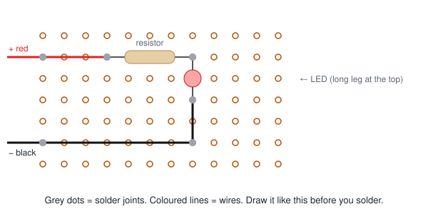

# S0.7 — Soldering II: desoldering, and the permanent dimmer

> **In one line:** learn to take parts back off a board without damaging it, then rebuild the S0.5
> dimmer as a soldered circuit tough enough to survive being dropped.

**A bench session, about 3 hours.** This session finishes module M0.3. ⚠️ Same hazards as S0.6.

---

## Where this fits
Mistakes happen, so taking a part back off a board (**desoldering**) is as important as soldering
it on. Then you make your first permanent circuit: the dimmer from S0.5, on perfboard. A breadboard
circuit falls apart if you shake it. A soldered one should survive a drop.

---

## Words you'll need
(Builds on S0.6: solder, pad, lead, perfboard, flux.)

- **Desoldering** means melting a joint and removing the solder, so the part can come out.
- **Desoldering braid** (or "wick") is a flat strip of woven copper. Pressed onto melted solder with
  the iron, it soaks the solder up like a sponge.
- A **solder pump** (or "solder sucker") is a spring-loaded tube. You heat the joint, then press a
  button and it sucks the melted solder away.
- A **lifted pad** is a copper pad that has peeled off the board, usually from too much heat or
  force. It's hard to repair.
- **Layout** is the plan of where every part and wire goes on the board.
- **Hookup wire** is ordinary insulated wire for connecting things. **Solid** wire (one thick
  strand) holds its shape, which is good for short links on the board. **Stranded** wire (many thin
  strands) bends without breaking, which is good for wires that move, like a battery lead.
- **Wire gauge** is how thick a wire is. Thicker wire can carry more current without heating up.
- **Strain relief** is anything that stops a wire's movement from pulling on its solder joint.
  Without it, the joint cracks after enough bending.

---

## The idea: plan before you solder
On a breadboard you can move things freely. On perfboard, every change costs a desoldering job and
risks lifting a pad. So you design the layout **on paper first**: where each part goes, and where
the + and − connections run. Mistakes cost an eraser on paper and twenty minutes on the board.

---

## Before you start
- ⚠️ **Hazards:** the same as S0.6: eyes, the iron, fumes. Same rule: if any of the safety kit is
  missing, the session doesn't happen.
- **You need:** desoldering braid, a solder pump, perfboard, hookup wire (stranded and solid), a 9 V
  battery clip, and the parts from your S0.5 dimmer.
- **Answer this in writing first:** *You lift a pad. List your options for recovering, best first.*
  (You answered this in S0.6. Look at your answer again; you might get to test it today.)

---

## Steps

### 1. Desolder with braid
*(Syllabus 0.3.5.)* Lay the braid on top of the joint. Press the iron on top of the braid. Wait
for the solder to melt and soak up into the braid. Lift the braid and the iron off **together**.
Don't drag the braid across the board; that's how pads get torn off.

### 2. Desolder with the pump
Cock the pump. Heat the joint until the solder melts. Put the pump's nozzle right next to it and
press the button. Pull the part out.

Remove three resistors from your S0.6 practice board with each method. If you lift a pad, that's
the question above happening for real. Write down what happened.

### 3. Plan the layout on paper
*(Syllabus 0.3.6.)* Draw the perfboard as a grid of dots. Place the battery clip, the selector
(switch or jumper), the four resistors and the LED. Decide where the + and − connections run.
**No soldering until the drawing is finished.**

*Figure 7.1: an example plan for a much simpler circuit (one resistor, one LED). Yours will have more parts, but the same idea.*

### 4. Choose the wire
*(Syllabus 0.3.8.)* Your circuit carries a few milliamps at most. Thin hookup wire is plenty.
Write one line saying why.

### 5. Build it
Push the parts in, bend their legs slightly outwards underneath so they stay put, solder each one,
then trim the leftover legs (pointing them down, as in S0.1).

### 6. Strain relief
*(Syllabus 0.3.7.)* The battery clip's wires will get bent every time you use it. Stop that bending
from pulling on the solder joints: loop the wires through a spare hole in the board before
soldering, or hold them down with a dab of hot glue or a cable tie.

### 7. Test every position
Check each dimmer setting against your S0.5 prediction sheet.

---

## How you know you're done (module M0.3 finished)
The syllabus's pass rule: **the board survives being dropped onto a desk from waist height, and
still works afterwards.** Drop it. Film the drop. Write a build-log entry marking **M0.3 closed**.

## Further reading (free)
- [SparkFun: Working with Wire](https://learn.sparkfun.com/tutorials/working-with-wire): solid vs stranded, gauges, and stripping
- [Adafruit Guide to Excellent Soldering](https://learn.adafruit.com/adafruit-guide-excellent-soldering): includes desoldering

Syllabus: module M0.3, objectives 0.3.5, 0.3.6, 0.3.7, 0.3.8. What these codes mean:
`curriculum/stage-0/README.md`.
