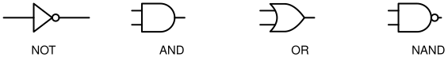
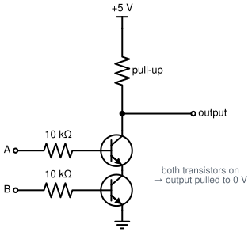

# S0.9 — Build a NAND gate from transistors, then NOT, AND and OR from NANDs

> **In one line:** turn transistor switches into your first logic gate, then prove that this one
> type of gate is enough to build every other kind.

**A bench session, about 3 hours.** This session finishes module M0.4.

---

## Where this fits
This is where electronics turns into computing. A **logic gate** takes inputs that are each 1 or 0
and produces an output that is 1 or 0 according to a fixed rule. The gate you build today, **NAND**,
is special: you can build *any* other gate out of NANDs, and so, in principle, an entire computer.
The CPU in Stage 1 starts here.

---

## Words you'll need
(Builds on S0.8: NPN transistor, base, collector, emitter, saturation, floating. And S0.4: divider,
load.)

- **HIGH and LOW** (or **1 and 0**): in a 5 V circuit, a wire near 5 V counts as HIGH (1) and a wire
  near 0 V counts as LOW (0). S0.2's VIH and VIL are the exact cut-offs for a
  real chip.
- A **truth table** lists every possible combination of inputs and the output for each. A gate with
  two inputs has four rows: 00, 01, 10, 11.
- The basic gates:

  | Inputs A B | NOT A | AND | OR | **NAND** |
  |---|---|---|---|---|
  | 0 0 | 1 | 0 | 0 | **1** |
  | 0 1 | 1 | 0 | 1 | **1** |
  | 1 0 | 0 | 0 | 1 | **1** |
  | 1 1 | 0 | 1 | 1 | **0** |

*Figure 9.1: the symbols for the four gates. The small circle on NOT and NAND means "then flip it".*

  **NOT** flips its single input. **AND** is 1 only if both inputs are 1. **OR** is 1 if either is.
  **NAND** means "NOT AND": the opposite of AND. It's 0 *only* when both inputs are 1.
- A **pull-up resistor** connects a wire to the + supply through a resistor. It holds the wire HIGH
  unless something stronger pulls it LOW.
- **Functionally complete** means a gate type can be used to build every other gate. NAND is
  functionally complete.
- **Fan-out** is how many other gate inputs one gate's output can drive before its signal gets too
  weak.

---

## The idea: a gate is just switches in a pattern
In S0.8 you saw that a transistor, switched on, connects its collector to ground. Now picture the
output wire held HIGH by a pull-up resistor. Put a transistor between that wire and ground: switch
it on and the output is pulled LOW.

The question for today is how to arrange **two** such switches so the output goes LOW **only when
both inputs are HIGH**. That's the NAND rule. Work it out yourself in step 2 before opening the
hint.

---

## Before you start
- **Hazards:** low. 5 V, with the current limit at about 100 mA.
- **You need:** at least eight 2N3904 transistors; 1 kΩ and 10 kΩ resistors; LEDs with 330 Ω
  resistors to show outputs; jumper wires.
- **Answer these in writing first:**
  1. Draw an XOR gate (output 1 when the two inputs are *different*) using only NAND gates. What's
     the smallest number of NANDs it can be done with, and how did you convince yourself that's the
     smallest? (Try it now; you may need to come back to it after the session.)
  2. Your NAND's output sits at 2.5 V when both inputs are LOW. What's wrong?

---

## Steps

### 1. Truth table first
Write the NAND truth table from memory. The rule to hold onto: the output is **LOW only when both
inputs are HIGH**.

### 2. Design the circuit yourself
*(Syllabus 0.4.8.)* You have: NPN switches (S0.8), resistors and 5 V. The output must go LOW only
when both inputs are HIGH. Questions to get you there:
- What holds the output HIGH when neither transistor is on?
- How do you arrange two switches so the output connects to ground **only when both are on**?

Draw it. Pick resistor values and write why. Add an LED with a 330 Ω resistor on the output so you
can see it.

Hint

A resistor from 5 V to the output holds it high (a pull-up). Two NPNs **in series** between the
output and ground: both must conduct to pull it low. Each base gets its own resistor from its input
(~10 kΩ is a reasonable start; check it against your S0.8 base-current method).

### 3. Check the truth table
Try all four input combinations. **Measure the output voltage** for each one, don't just look at the
LED. Write the readings down.

### 4. What the pull-up does
*(Syllabus 0.4.9.)* Predict what happens if you remove the pull-up resistor. Remove it and measure.
Then swap the 1 kΩ pull-up for 10 kΩ and measure the HIGH output with the LED connected. Why did it
drop? (The pull-up and the LED's circuit form a divider, which is S0.4's idea again. This is the
2.5 V question's territory too.)

### 5. NOT, AND and OR, from NANDs only
*(Syllabus 0.4.10.)* For each one, work it out on paper from the truth tables first, *then* build it
and check it. This is how the module is passed, so try hard before opening a hint.

Hint: NOT
What does NAND do when both inputs are the same signal?

Hint: AND
NAND is AND followed by something. Undo the something.

Hint: OR
Invert each input first, then NAND them. Why that works has a
name, De Morgan's law. Look it up; you'll study it properly in Stage 1.

### 6. Fan-out, briefly
When one NAND's output feeds another NAND's input, the second gate's base resistor draws current
from the first gate's pull-up. Measure the first gate's HIGH output voltage with one gate attached,
then with two.

---

## How you know you're done (module M0.4 finished)
The syllabus's pass rule: **you can work out any of NOT, AND or OR on paper, then build it without
looking anything up.** Have your brother pick one; build it with this guide closed. Write a
build-log entry marking **M0.4 closed**. Episode 3.

## Further reading (free)
- [SparkFun: Digital Logic](https://learn.sparkfun.com/tutorials/digital-logic): gates, truth tables and their symbols
- [Lessons in Electric Circuits, Vol. IV, ch. 3: Logic Gates](https://www.ibiblio.org/kuphaldt/electricCircuits/Digital/DIGI_3.html): builds gates from transistors, which is exactly this session
- [logic.ly demo](https://logic.ly/demo): try NOT, AND and OR from NANDs on screen before the bench

Syllabus: module M0.4, objectives 0.4.8, 0.4.9, 0.4.10. What these codes mean:
`curriculum/stage-0/README.md`.
