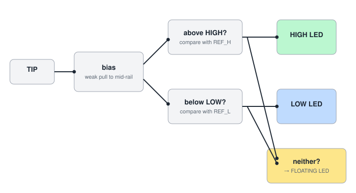
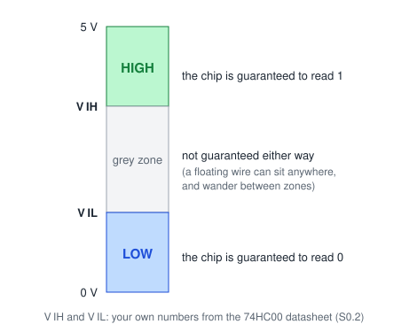

# S0.10 — Final project, part 1: designing the logic probe

> **In one line:** design, on paper and then on a computer, a handheld tool that tells you whether a
> wire is HIGH, LOW, or not connected to anything at all.

**Two evening sessions, at a desk.** First on paper, then in KiCad (free circuit-drawing software).

---

## What you're building
A **logic probe**: a pen-sized tool with a metal tip and three LEDs, labelled **HIGH**, **LOW** and
**FLOATING**. You clip two of its wires onto the 5 V and ground of the circuit you're checking (that
powers the probe), then touch the tip to any wire to see its state.

You'll use it for six months of debugging the CPU in Stage 1. The hard part, and the reason it's
the final project of Stage 0, is the third LED: **floating**.

---

## Words you'll need
(Builds on S0.2: VIH, VIL. S0.4: divider, loading. S0.8: floating. S0.9:
HIGH/LOW, NOR-style "neither" logic.)

- **Driven vs floating.** A wire is **driven** when something is actively holding it HIGH or LOW,
  such as a chip's output. A wire is **floating** when nothing is: it's connected only to inputs, or
  to nothing at all. A floating wire picks up stray electrical noise, and its voltage wanders.
- **Strong vs weak** (the proper term is **low impedance vs high impedance**). A chip's output is a
  *strong* driver: connect something to it and its voltage hardly moves. A large resistor is a
  *weak* driver: connect something and it's easily overpowered. You saw this in S0.4, when a load
  dragged a divider's voltage down.
- **CMOS** is the type of chip technology the 74HC family uses. A CMOS input draws almost no
  current, so a floating CMOS input really does drift.
- A **threshold** is a dividing line voltage: above it means one thing, below it means another.
- A **reference voltage** is a fixed voltage you make on purpose (usually with a divider), to
  compare other voltages against.
- A **comparator** is a circuit (or chip) with two inputs that tells you which of them is higher.
  Compare the probe tip against a reference and you know which side of the threshold the tip is on.
- **Open-collector** describes a type of output that can pull a wire LOW but can't push it HIGH on
  its own. It needs a pull-up (S0.9). You'll check the details in a datasheet.
- A **schematic** is the standard drawing of a circuit, using symbols for each part. A **net** is a
  named connection in a schematic: every point with the same net name is joined.
- A **BOM** (bill of materials) is the shopping list: every part, its value, and how many.
- **KiCad** is free software for drawing schematics (and, later, designing circuit boards).

---

## Think about it before reading further
A floating input isn't a particular voltage. It's *nothing driving the wire*. Touch a meter to it
and you just get some random number. **So how could a probe tell "nothing is driving this" apart
from "this is being driven LOW"?**

Spend 20 minutes on that question in your notebook before opening the hints. Two things you already
know will help: in S0.4 a weak divider lost to a strong load, and in S0.8 a floating gate drifted.

Hint 1: the trick
Give the tip a <b>weak opinion of its own</b>: bias it
towards the middle of the supply with two equal, high-value resistors. A real logic output is
low-impedance and overpowers that bias easily; with nothing connected, the tip sits mid-rail.

Hint 2: deciding

Two thresholds. Above the HIGH threshold → HIGH LED. Below the LOW threshold → LOW LED. Between them
→ neither → FLOATING LED. The name for the first part is a **window comparator**. Look it up.

---

## Design questions: answer each in writing, with numbers

*Figure 10.1: the zones a logic input reads (from S0.2). A floating wire can sit anywhere.*

1. **Thresholds.** Use the 74HC00 numbers you found in S0.2: VIH and VIL at
   5 V. Your HIGH threshold should sit at or above VIH, and your LOW threshold at or below
   VIL. Why must there be a gap between the two?
2. **The bias resistors' value.** Too small, and the probe *loads* the circuit you're testing: it
   becomes part of the circuit and changes it. Too large, and stray noise moves the tip around, like
   S0.8's floating gate. Pick a value and justify it with a loading calculation against a weak
   driver, such as S0.9's own 10 kΩ pull-up.
3. **Making the thresholds.** Use a divider for each reference voltage. Calculate the resistor values
   (from the E12 list) and the threshold voltages they actually give.
4. **Doing the comparing.** There are two ways. Choose one and say why:
   - **Discrete transistors**, like S0.8 and S0.9. Closest to the syllabus's requirement that you
     can explain it "at the transistor level", but harder to get sharp, accurate thresholds.
   - **A dual comparator chip** (the LM393 type). Sharp, reliable thresholds. Its outputs are
     **open-collector**: read its datasheet and work out what that means for lighting an LED.

   Whichever you choose, you must be able to explain how floating detection works **at the
   transistor level**. That's one of the four tests in S0.11.
5. **The "neither" LED.** The FLOATING LED lights only when the HIGH stage *and* the LOW stage are
   both off. That's a NOR of the two (OR, then NOT), which you can build from what you learned in
   S0.9.
6. **Protection.** What happens if the tip accidentally touches 9 V, or the supply clips go on the
   wrong way round? Add a resistor in series with the tip, and consider a diode on the supply.
7. **Current budget.** Three LEDs, with at most one or two on at once. How much current does the
   probe draw in total from the circuit it's testing?

---

## Then, in KiCad
1. Install KiCad (free, from kicad.org). Work through its official getting-started tutorial up to
   **schematic capture** (drawing the schematic). Skip the board-layout part for now.
2. Draw your probe's schematic. Every part gets a value. Every net gets a name: TIP, VCC (the 5 V
   supply), GND (ground), REF_H and REF_L (your two reference voltages).
3. Export the schematic as a PDF, and export a bill of materials. **Buy whatever's missing before
   S0.11.**

---

## How you know you're done
- Every design question is answered in writing, with numbers.
- A KiCad schematic exists, and a BOM.
- **If you can spare an hour, build it on a breadboard first.** Prove HIGH, LOW and FLOATING work
  there before committing to solder. A fault found on a breadboard costs minutes; on perfboard it
  can cost a rebuild.

## Further reading (free)
- [SparkFun: Logic Levels](https://learn.sparkfun.com/tutorials/logic-levels): the zones in Figure 10.1, in more depth
- [SparkFun: How to Read a Schematic](https://learn.sparkfun.com/tutorials/how-to-read-a-schematic): before you draw one in KiCad
- [KiCad documentation](https://docs.kicad.org/): the official guides, including getting started

Syllabus: capstone C0 (the stage's final project). What these codes mean:
`curriculum/stage-0/README.md`.
